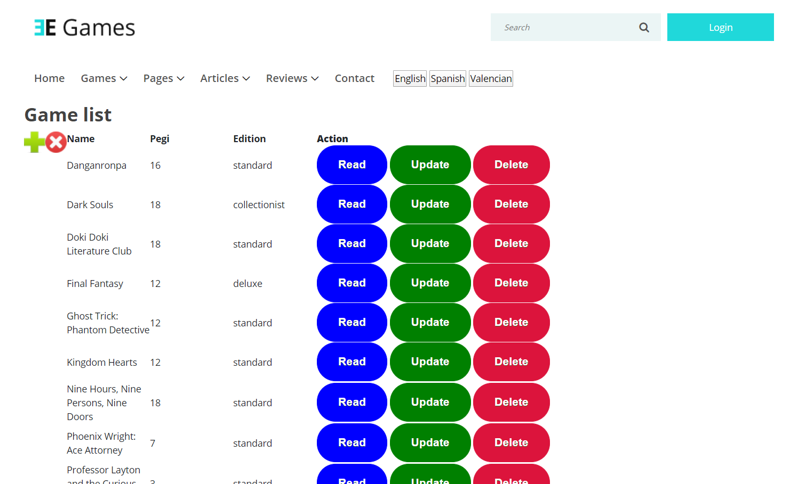

## Introduction

It is a simulation of a video game store webpage called EGames.
The technologies used in this webpage are: PHP, JS, jQuery, HTML, CSS, Bootstrap and JSON.

## Files architecture

<pre>
┌ DAO  
│  ├ controllers  
│  └ Models  
├ model  
├ module  
│    ├ aboutus  
│    ├ contact  
│         ├ controller  
│         └ view  
│    ├ inicio  
│         ├ controller  
│         ├ model  
│         └ view  
│    ├ lang  
│    ├ services  
│    ├ shop  
│         ├ controller  
│         ├ model  
│         └ view  
│    └ user  
│         ├ controller  
│         ├ model  
│         └ view  
├ utils  
└ view  
    ├ css  
    ├ fonts  
    ├ img  
       ├ bg-img  
       └ core-img  
    ├ inc  
    ├ js  
    └ scss
</pre>

## CRUD

It has a CRUD where you can modify the games in your database.

